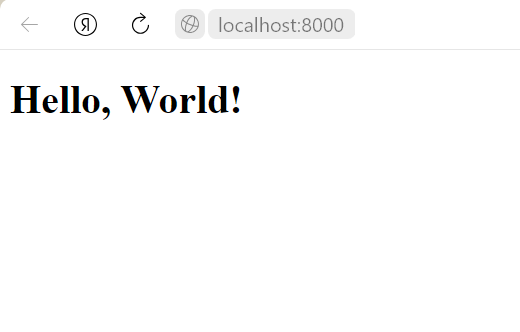

# Запускаем сервер nginx из под docker



# Сборка и запуск сервера 

Скачайте к себе проект с github командой в терминале:
```
git clone https://github.com/prog815/test-nginx-docker.git
```
В текущей папке появится папка с проектом `test-nginx-docker`. Перейди в нее.

Запускаем сервер по команде в терминале:
```
docker-compose up -d
```

# Работа

Открываем в браузере по ссылке http://localhost:8000/

# Выключение

Останавливаем сервер по команде в терминале:
```
docker-compose down
```

Удаляем образ сервера по команде в терминале:
```
docker rmi nginx
```